[](https://github.com/vishnu-raju/ml_api_with_cicd/actions/workflows/main.yml)

# Overview

This project was carried out to setup a CI/CD pipeline for a python based Machine Learning application which predicts housing prices in the city of Boston.

Continuous Integration is enabled by the use of GitHub as source control management service and its GitHub Actions service to perform linting and unit testing to ensure the software is in a usable state.

Continuous Delivery/Deployment is then enabled using Azure pipeline to deploy the latest changes to the software into production.

Any commits/merges to the master branch of the repository "main" is considered to be a change that needs to deployed. As a result of this action, GitHub actions and Azure Pipeline is triggered.

## Project Plan
This project was carried out using Agile methodologies and details of the planning can be view in the below artifacts:

* A [link](https://trello.com/b/Vc2J9tU9/ml-app-ci-cd-pipeline) to a Trello board for the project
* A [link](./vnr_project-management.xlsx) to a spreadsheet that includes the original and final project plan

## Instructions

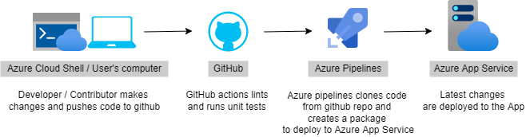

In order to recreate the CICD pipeline, follow the steps detailed below.

* Clone the repository into Azure Cloud Shell and change directory
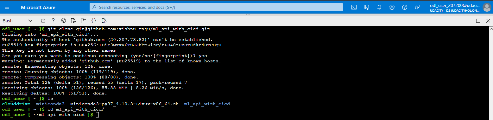

* Create a virtual environment using the Make command and then activate it
```
make setup
```
```
source ~/.mlapi/bin/activate
```
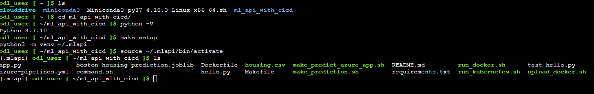

* Install dependencies required to run the app
```
make install
```
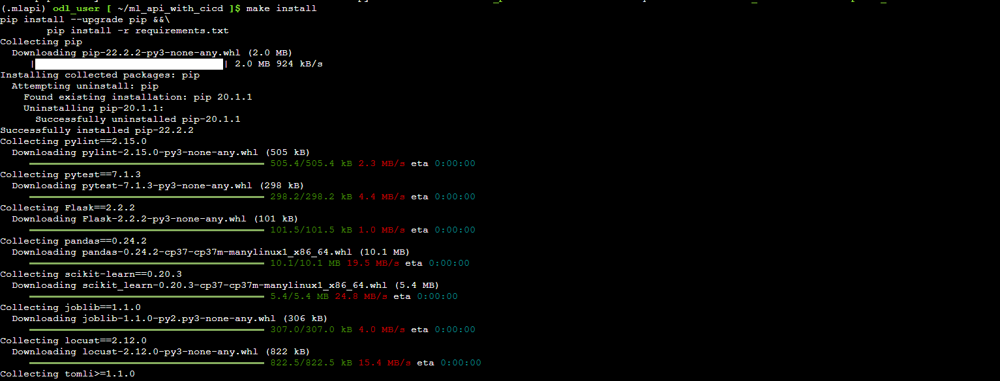

* Lint code and run unit test to confirm it's working
```
make lint
```
```
make test
```
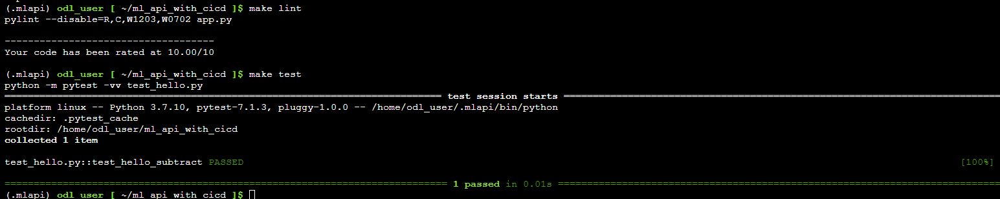

NOTE: All of the above commands can be run at once using `make all`

* Run the app locally on one terminal and test by making an API call from another terminal
```
python app.py
```
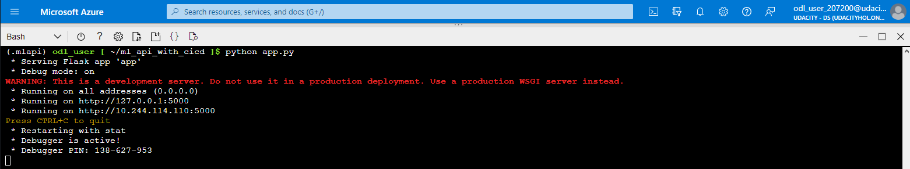

```
sh ./make_prediction.sh
```
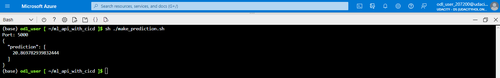

* Now, that the app is succesfully running locally, it can be deployed as an Azure WebApp and make requests to the API
```
az webapp up --name <app_name> --resource-group <resource_group_name> --runtime "PYTHON:3.7"
```
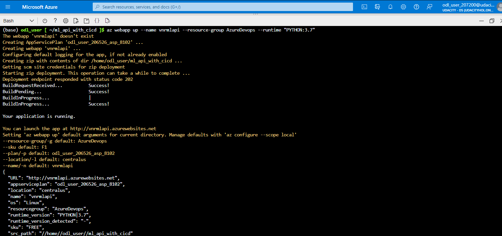

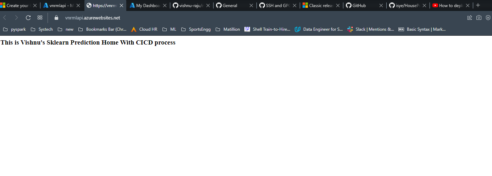

Once the application is deployed, we can make an API request using the command
NOTE: Change the url in the file 'make_predict_azure_app.sh'
```
sh ./make_predict_azure_app.sh
``` 
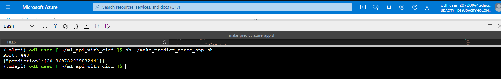

Logs from the webapp can be viewed using the command
```
az webapp log tail
```
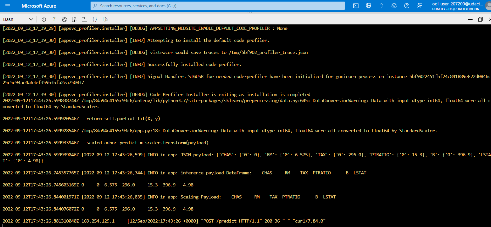

Azure pipeline can now be configured for the webapp as detailed below:
[Note the official documentation should be referred to and double checked as you setup CI/CD](https://docs.microsoft.com/en-us/azure/devops/pipelines/ecosystems/python-webapp?view=azure-devops).

* Create a Devops Project
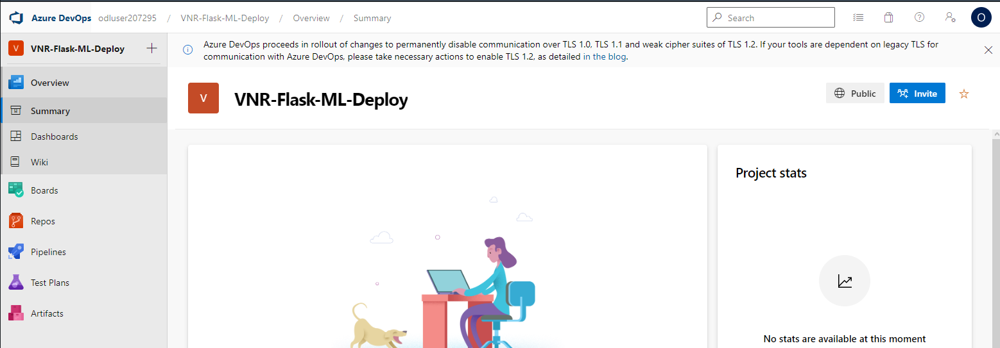

* Create a Service Connection
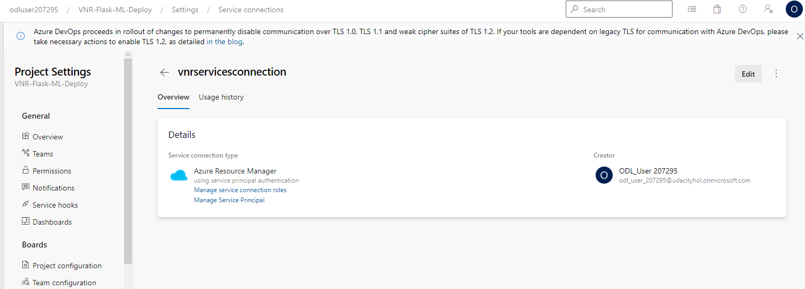

* Create a Agent Pool
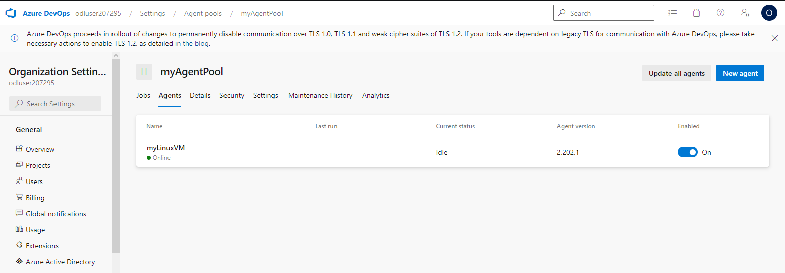

* Create Azure Pipeline
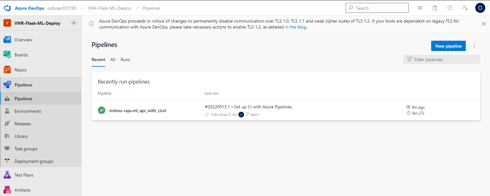

* Run Pipeline to deploy the WebApp / Commit new features to the 'main' branch, which will automatically trigger the pipeline
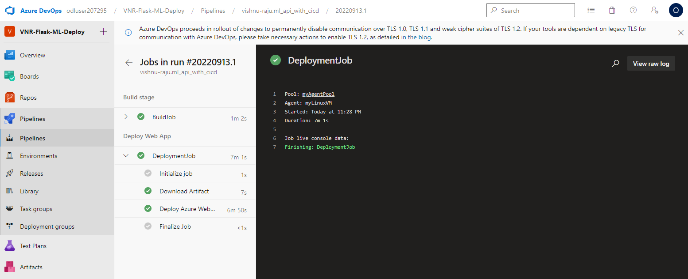

* Load test using Locust
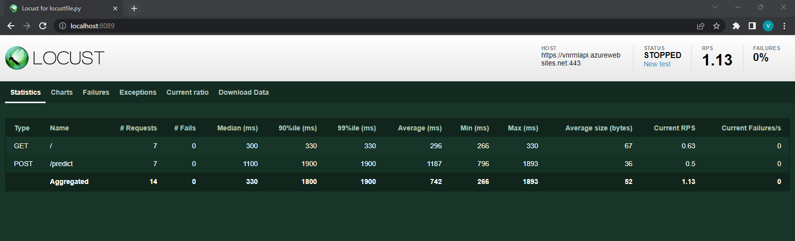

## Enhancements
Several improvements can be made to this project, some of the ideas are:

* Currently the 'main' branch is unprotected. This branch can be setup such that additions can only be made using Pull Requests
* Instead of using Azure Pipelines, GitHub actions itself can be used to setup continuos delivery/deployment
* This app can be containerized as a Docker app and be deployed using Kubernetes

## Demo 

https://www.youtube.com/watch?v=Vs4AUya_4g8


